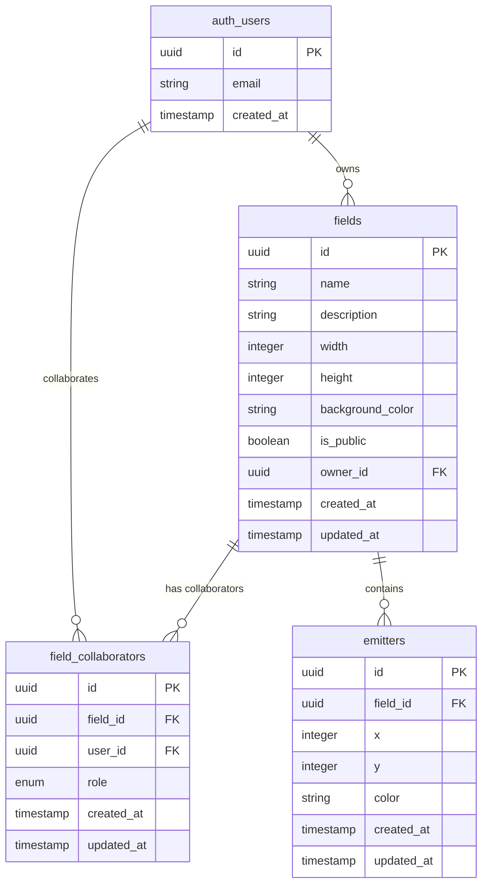

# Emittance Fields

In it's simplest form, this can be thought of as an r/place implementation. We have a "field" of variable size, and users can place "emitters" at points within that field. These emitters can be thought of as unmoving pixels with only `{x,y,color}` as state.

In it's fully realized form, the field is more like a flow field simulation, with the emitters emitting particles with `{x,y,x_velocity,y_velocity,color,lifespan,count,modulation}` as state. We could even have different types of emitters, though I'm not sure what those could be. We could also allow parametric equations for each of the variables, but this adds a lot of complexity very quickly and I'd like to stay focused on the Authorization.

## Data Models

### Fields

- `id`: UUID, primary key
- `name`: text, not null
- `description`: text, nullable
- `width`: integer, not null, must be > 0 and <= 1000
- `height`: integer, not null, must be > 0 and <= 1000
- `background_color`: text, not null, default `#000000`
- `is_public`: boolean, not null, default `false`
- `owner_id`: UUID, not null, references `auth.users(id)`
- `created_at`: timestamp with time zone, not null, default `now()`
- `updated_at`: timestamp with time zone, not null, default `now()`

### Emitters

- `id`: UUID, primary key
- `field_id`: UUID, not null, references `fields(id)`
- `x`: integer, not null, must be >= 0
- `y`: integer, not null, must be >= 0
- `color`: text, not null, default `#ffffff`, must match `^#[0-9A-Fa-f]{6}$`
- `created_at`: timestamp with time zone, not null, default `now()`
- `updated_at`: timestamp with time zone, not null, default `now()`

### Field Collaborators

- `id`: UUID, primary key
- `field_id`: UUID, not null, references `fields(id)`
- `user_id`: UUID, not null, references `auth.users(id)`
- `role`: enum (`viewer`, `editor`), not null, default `viewer`
- `created_at`: timestamp with time zone, not null, default `now()`
- `updated_at`: timestamp with time zone, not null, default `now()`
- Unique constraint on (`field_id`, `user_id`)

## Constraints & Validation

### Field Constraints

- Width and height must be between 1 and 1000 pixels
- Background color must be valid hex format (#RRGGBB)
- Field names must be unique per owner

### Emitter Constraints

- X coordinate must be >= 0 and < field.width
- Y coordinate must be >= 0 and < field.height
- Color must be valid hex format (#RRGGBB)
- Maximum 10,000 emitters per field

### Collaboration Constraints

- Users cannot collaborate with themselves
- Only field owners can add/remove collaborators
- Collaborators cannot change their own role (owner must do this)
