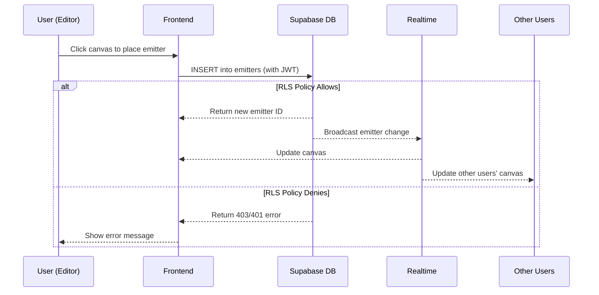

# System Overview

## What: User Perspective

**Emittance Fields** is a collaborative visual system where users create and share digital canvases called "fields." Right now, it's the same concept as r/place, but I plan to add a flowfield-like particle simulation system in the future.

- Users can create private or public fields with custom dimensions
- Users can add collaborators to their fields with viewer or editor permissions
- Owners and Editors can place emitters on the field
- Public fields are visible to all users
- Changes to emitters are reflected in real time to other users

### Emitter Placement Workflow

## How: Engineering Perspective

The system leverages Supabase for the database, authorization, and authentication. Authorization is enforced via RLS Policies and validated via pgTAP tests.

Authorization leverages a hybrid ACL/RBAC model. Each field has a sort of ACL List through the `field_collaborators` table, which contains a list of users and their roles. Users can be:

- Anonymous: Can only view public fields and emitters
- Viewer: Can view field, emitters, and collaborators for the field they have access to
- Editor: Can view, create, and edit emitters for the field they have access to, and view collaborators for the field they have access to
- Owner: Can view, create, edit, and delete fields, emitters, and collaborators for the field they own

Users can also delete their own collaborations.

The RLS Policies leverage security definer functions to enforce these permissions. The RLS Policies are defined in the `policies.sql` file. The security definer functions are defined in the `functions.sql` file.

### Architecture Stack

- **Frontend**: SvelteKit 5.0 with TypeScript and Tailwind CSS
- **Backend**: Supabase (PostgreSQL + Authentication)
- **Authorization**: RLS policies with pgTAP testing
- **Real-time**: Supabase realtime for live updates

### Data Models

See the schema files in the `supabase/schemas` directory.

## Why: Design Philosophy

### Authorization-First Design

This system was designed as an **authorization challenge**, with >50% of development effort focused on access control. The collaborative nature creates natural permission boundaries:

- **Field ownership**: Who can modify field settings?
- **Collaboration roles**: What can viewers vs editors do?
- **Public access**: How do anonymous users interact?
- **Data isolation**: How do we prevent unauthorized access?

From the beginning, I was deciding between using Supabase's RLS or using an in-memory permission service. For most projects, especially those with more complex authorization requirements or with the need for more visibility into the permissions, I would use an in-memory permission service. For this project, I knew I wanted to set up Supabase for the database, and implementing an in-memory service would have been redundant and time-consuming.

As an aside, I actually have strong feelings _against_ RLS. I find them opaque, hard to manage, and hard to test. It wasn't until I found Supabase's [Advanced pgTAP Testing](https://supabase.com/docs/guides/local-development/testing/pgtap-extended) page where I realized that efficient E2E testing of RLS policies was possible. There were a lot of gotchas with initially setting this up, but I know view RLS in a more familiar light. Either way, for the scope of this project it's a perfect choice.

### On using Svelte(kit)

The second (arguably more important) benefit of enforcing Authorization via RLS is that it allowed me to be more liberal with my frontend code.

I was comfortable leveraging Ampcode to generate large portions of the frontend code. This is _not_ code I would use in a production application (at least not without implementing a thorough Playwright test suite first). My UX was not a priority, and I just wanted to create a protorype that shows off the core vision of the system, along with easily validating the collaboration and authorization logic.

### Testing Methodology

Since the database itself (through functions and policies) functions as the business logic, I leveraged pgTAP to test the authorization logic. If this project was to be used in a production application, I would implement a thorough Playwright test suite as well.
