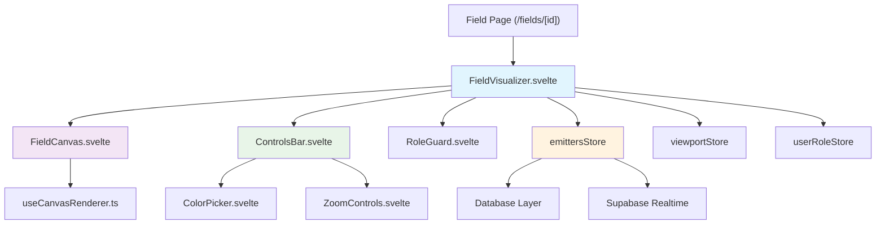

# Visualization Interface Implementation Plan

## Overview

This document outlines the implementation plan for the Emittance Fields visualization interface - a collaborative canvas system where users can place colored "emitters" (pixels) at specific coordinates, similar to r/place. The interface must handle real-time collaboration, proper authorization, and smooth canvas rendering.

## Architecture Diagram



## Component Architecture

### Core Components

#### 1. FieldVisualizer.svelte

**Purpose**: Main orchestration component that combines canvas, controls, and authorization
**Location**: `src/lib/fields/FieldVisualizer.svelte`

```typescript
interface Props {
	field: Field;
	role: 'owner' | 'editor' | 'viewer';
}
```

**Responsibilities**:

- Initialize emitters store with field data
- Set up real-time subscription for collaborative updates
- Manage overall layout and component coordination
- Handle error states and loading indicators

#### 2. FieldCanvas.svelte

**Purpose**: Pure canvas rendering component for the field visualization
**Location**: `src/lib/fields/canvas/FieldCanvas.svelte`

```typescript
interface Props {
	field: Field;
	viewport: Writable<Viewport>;
	emitters: Readable<Map<string, Emitter>>;
	canEdit: boolean;
}
```

**Responsibilities**:

- Render field background and emitters on HTML5 canvas
- Handle mouse/touch interactions for emitter placement
- Manage canvas performance optimizations
- Transform screen coordinates to field coordinates

#### 3. ControlsBar.svelte

**Purpose**: UI controls for editing emitters and managing canvas view
**Location**: `src/lib/fields/controls/ControlsBar.svelte`

```typescript
interface Props {
	canEdit: boolean;
	selectedColor: Writable<string>;
	viewport: Writable<Viewport>;
}
```

**Responsibilities**:

- Color picker for emitter colors
- Zoom and pan controls
- Clear/undo buttons (editor/owner only)
- Role indicator badge

#### 4. RoleGuard.svelte

**Purpose**: Authorization overlay that restricts interaction based on user role
**Location**: `src/lib/fields/RoleGuard.svelte`

**Responsibilities**:

- Show "view-only" overlay for viewers
- Block pointer events for unauthorized users
- Display appropriate messaging for different roles

### Supporting Components

#### 5. CanvasOverlay.svelte

**Purpose**: Visual enhancements over the canvas
**Location**: `src/lib/fields/canvas/CanvasOverlay.svelte`

**Features**:

- Optional grid overlay
- Cursor position indicator
- Hover preview of emitter placement
- Crosshair for precise placement

#### 6. ColorPicker.svelte

**Purpose**: Color selection interface for emitters
**Location**: `src/lib/fields/controls/ColorPicker.svelte`

**Features**:

- RGB color picker with validation
- Recent colors palette
- Hex color input
- Color format validation (#RRGGBB)

#### 7. ZoomControls.svelte

**Purpose**: Zoom and pan interface
**Location**: `src/lib/fields/controls/ZoomControls.svelte`

**Features**:

- Zoom in/out buttons
- Fit to screen button
- 1:1 scale button
- Pan reset button

## Data Stores

### 1. emittersStore

**Location**: `src/lib/stores/emitters.ts`

```typescript
interface EmitterStore {
	subscribe: (fn: (emitters: Map<string, Emitter>) => void) => () => void;
	init: (fieldId: string, emitters: Emitter[]) => void;
	add: (data: EmitterInsert) => Promise<void>;
	update: (id: string, data: EmitterUpdate) => Promise<void>;
	remove: (id: string) => Promise<void>;
	applyServerPatch: (payload: RealtimePayload) => void;
}
```

**Features**:

- Optimistic updates with rollback on failure
- Real-time patch application
- Connection to database layer
- Efficient diff-based updates

### 2. viewportStore

**Location**: `src/lib/stores/viewport.ts`

```typescript
interface Viewport {
	x: number; // Pan offset X
	y: number; // Pan offset Y
	scale: number; // Zoom level (0.1 to 10)
}
```

### 3. userRoleStore

**Location**: `src/lib/stores/userRole.ts`

```typescript
type UserRole = 'owner' | 'editor' | 'viewer';
```

## Utilities

### 1. useCanvasRenderer.ts

**Location**: `src/lib/fields/canvas/useCanvasRenderer.ts`

**Purpose**: High-performance canvas rendering with optimizations
**Features**:

- ImageData-based pixel manipulation
- Batch updates with requestAnimationFrame
- Dirty region tracking
- Optional OffscreenCanvas support

### 2. coords.ts

**Location**: `src/lib/utils/coords.ts`

**Purpose**: Coordinate transformation utilities
**Functions**:

- `screenToField(event, canvas, viewport)`: Transform mouse coordinates to field coordinates
- `fieldToScreen(x, y, canvas, viewport)`: Transform field coordinates to screen coordinates
- `clampToField(x, y, field)`: Ensure coordinates are within field bounds

### 3. supabaseRealtime.ts

**Location**: `src/lib/utils/supabaseRealtime.ts`

**Purpose**: Real-time collaboration utilities
**Functions**:

- `connectEmittersChannel(fieldId)`: Set up real-time subscription
- `handleEmitterChange(payload)`: Process real-time updates
- `disconnectChannel()`: Clean up subscription

## Performance Considerations

### Canvas Optimization

- Use `ImageData` for direct pixel manipulation
- Implement dirty region tracking to only redraw changed areas
- Batch updates using `requestAnimationFrame`
- Consider `OffscreenCanvas` for large fields
- Use `ctx.imageSmoothingEnabled = false` for pixel-perfect rendering

### Memory Management

- Implement viewport culling for large fields
- Use object pooling for frequently created/destroyed emitters
- Clean up event listeners and subscriptions on component destroy
- Lazy load emitters outside visible viewport

### Network Optimization

- Implement optimistic updates for immediate feedback
- Batch multiple rapid changes before sending to server
- Use websocket connection for real-time updates
- Implement exponential backoff for failed requests

## Real-time Collaboration

### Supabase Realtime Integration

```typescript
// Set up real-time channel for field updates
const channel = supabase
	.channel(`emitters-${fieldId}`)
	.on(
		'postgres_changes',
		{
			event: '*',
			schema: 'public',
			table: 'emitters',
			filter: `field_id=eq.${fieldId}`
		},
		handleEmitterChange
	)
	.subscribe();
```

### Conflict Resolution

- Use optimistic updates with server reconciliation
- Last-write-wins for emitter updates
- Visual feedback for failed operations
- Automatic retry with exponential backoff

## Authorization Integration

### Role-Based Access Control

```typescript
const canEdit = derived([userRoleStore], ([$role]) => $role === 'owner' || $role === 'editor');
```

### UI Adaptations

- Hide editing controls for viewers
- Show read-only indicators
- Provide clear feedback for unauthorized actions
- Maintain consistent behavior across all components

## Responsive Design

### Canvas Scaling

```css
canvas {
	width: 100%;
	height: auto;
	aspect-ratio: var(--field-width) / var(--field-height);
	image-rendering: pixelated;
	image-rendering: -moz-crisp-edges;
	image-rendering: crisp-edges;
}
```

### Mobile Considerations

- Touch-friendly controls
- Responsive control panel layout
- Gesture support for zoom/pan
- Proper touch event handling

## Implementation Phases

### Phase 1: Core Canvas Rendering

- [ ] Implement `FieldCanvas.svelte` with basic rendering
- [ ] Create `useCanvasRenderer.ts` with performance optimizations
- [ ] Build `emittersStore` with CRUD operations
- [ ] Add coordinate transformation utilities

### Phase 2: User Interface

- [ ] Implement `ControlsBar.svelte` with color picker
- [ ] Add `ZoomControls.svelte` for viewport management
- [ ] Create `RoleGuard.svelte` for authorization
- [ ] Build responsive layout system

### Phase 3: Real-time Features

- [ ] Integrate Supabase Realtime for collaboration
- [ ] Implement optimistic updates with rollback
- [ ] Add conflict resolution mechanisms
- [ ] Create presence indicators (optional)

### Phase 4: Polish & Testing

- [ ] Add comprehensive error handling
- [ ] Implement loading states and transitions
- [ ] Write unit tests for core utilities
- [ ] Create end-to-end tests for collaboration

## Testing Strategy

### Unit Tests

- Coordinate transformation functions
- Store state management
- Canvas rendering utilities
- Color validation helpers

### Integration Tests

- Real-time collaboration scenarios
- Authorization role changes
- Performance under load
- Error handling and recovery

### End-to-End Tests

- Multi-user collaboration
- Permission enforcement
- Canvas interaction flows
- Responsive design validation

## File Structure

```
src/lib/fields/
├── FieldVisualizer.svelte          # Main orchestration component
├── canvas/
│   ├── FieldCanvas.svelte          # Canvas rendering
│   ├── CanvasOverlay.svelte        # Visual enhancements
│   └── useCanvasRenderer.ts        # Performance utilities
├── controls/
│   ├── ControlsBar.svelte          # Main controls container
│   ├── ColorPicker.svelte          # Color selection
│   └── ZoomControls.svelte         # Zoom/pan controls
├── RoleGuard.svelte                # Authorization overlay
└── presence/                       # Future: user cursors

src/lib/stores/
├── emitters.ts                     # Emitter data management
├── viewport.ts                     # Zoom/pan state
└── userRole.ts                     # Authorization state

src/lib/utils/
├── coords.ts                       # Coordinate transformations
└── supabaseRealtime.ts            # Real-time utilities
```

## Next Steps

1. **Set up the basic store architecture** for emitters and viewport management
2. **Implement the core canvas rendering** with performance optimizations
3. **Add real-time collaboration** through Supabase Realtime
4. **Build the user interface controls** with proper authorization
5. **Integrate with the existing field page** and test thoroughly

This architecture ensures separation of concerns, maintains performance, and provides a solid foundation for the collaborative emitter visualization system.
